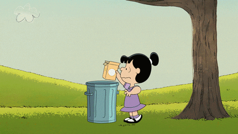

  

# <h1 align="center">RecycleRoute :recycle:</h1>

Our planet is slowly dying and is about to enter an irreversible stage. Take action and make a difference with RecycleRoute! RecycleRoute is an app that lets you upload a photo of any item and discover where to recycle, sell, donate, or dispose of it responsibly. RecycleRoute also offers valuable tips and tracks your environmental impact. Let's safeguard our planet together—before it's too late—by using RecycleRoute!

 

## MVP :hammer_and_wrench:

- User account with user authentication
  - Recycled Statistics are tracked and accessible in user profile
- Allows users to take photos of objects in the app
  - Uses Google Cloud Vision API to identify objects and decipher what category of trash they belongs to
- Have a bag feature so you can put multiple items into a bag and find tips for everything (instead of one at a time)
- Shows nearest facilities to dispose of items
  - (Chemical Collection Center for Batteries, Recycling center for recyclables, Selling/donation center for clothes and Electronic Recycling Centers for old electronics)
- Provides waste guides and helpful tips depending on the category of object
  - Do NOT throw away batteries, instead dispose at a designated battery recycling center
- Chatbot for answering recycling-related questions
  - Where should I throw it away?
  - Is it safe to recycle this?
       

## Stretch Goals :rocket:
- Crowdsourcing feature to add/verify location of recycling bins and other disposal locations 
- Community post page to feature events to volunteer to pick up trash/clean environments
- Social tab/ Leaderboard to compare points with friends and other users
- Garbage & Recycling Schedules
- DIY Recycling Projects (crafts, gardening, etc)
- Gamification with points, levels, streaks, goals, quests, and rewards

 

## Milestones :calendar:

  
**
Week 1: Set Up 09/4 - 09/11 :seedling: 
**

#### General:

- Discuss who’s frontend/backend and the overall project/tech stack
- Set up communication, environments, and WhenToMeet
- Go over GitHub basics
- Start working on UI designs with Figma
  - Low Fidelity to High Fidelity

#### Frontend

- Look into React Native and CSS

#### Backend

- Start looking into Tech Stack (PostgreSQL, Express, Node.js)
- Play around with the APIs (use Postman)
- Look into LLM for chatbot and start playing around with it
 

  
**
Week 2: 09/11 - 09/18 :shamrock: 
**

#### Frontend:

- Go over some UI design basics
- Flesh out the collective vision for the app
- Figma Design **due** by the **end of week 2**

#### Backend:

- Plan out database design schema
- Start setting up the User Authentication and the Database. Have a working prototype by the end of the 2nd week
- Keep doing research with the tech stack and APIs
- Look into LLM for chatbot and start playing around with it

 

  
**
Weeks 3/4: Coding  09/18 - 10/02 :potted_plant: 
**
  
#### Frontend:
  - Code initial screens
    - **Login/SignUp Pages** 
    - **Picture Page** 
      - Should be able to take/upload pictures of an object
      - Identifies what the item is and provides a helpful guide and tips on how to recycle it (image a <a href="https://youtu.be/NBmLFMN0fdw?si=-kPb11z3OIlgmm82&t=1285">Pokedex </a>)
        -  Access to the Recycle Page
      - Have a bag to add uploaded multiple objects
        - Shows quantity, item, and ability to remove
    - **Recyle Page** 
      - Google Maps with custom icons for recycling areas
      - Google Map integration that shows the nearest available disposal facilities

#### Backend:

- Set up the APIs for object detection and categorizing the type of recycling
- Start training the LLM and setting up the chatbot
- Start working on adding guides and tips that appear when trash items are received
 

**
Weeks 5/6: Middle Ground 10/02 - 10/16 :cactus:
**

#### Frontend:

- **Profile Page**

  - Has user’s information and their statistic
  - History of what has been recycled

- **Home page**
  - Has user statistic
    - Number of \_\_\_ recycled
    - Reduced Carbon footprint
    - How long the world could last if everyone recycled like you
  - Helpful guides and tips for recycling
- **Chatbot Page**
  - Should allow the user to input any text they want

#### Backend:

- Connect the login/create page with the backend database
- **Home Page**
  - List the user’s stats and their impact on the planet
  - Provides courses/links/videos to tips on how to recycle
- **User Database**
  - Each object the user recycles is stored in history and the statistics are tracked and updated
- **Chatbot Implementation**
  - Have it work with some basic questions like: - Where should I throw it away? - Is it safe to recycle this?
   
  

**
Weeks 7/8: Finishing Touches 10/16 - 10/30 :deciduous_tree:
**

- Backend and Frontend communicate to finish integration to connect and test
- Have the **entire** app **working**
- If possible work on stretch goals:
  - Community post page to feature events to volunteer to pick up trash/clean environments
  - Social tab/ Leaderboard to compare points with friends and other users
  - DIY Recycling Projects (crafts, gardening, etc)
- Begin **working** on the **script**

#### Frontend:

- Polish up MVP features and help the backend if needed

#### Backend:

- Finish everything
 

**
Weeks 9/10: Preparations 10/30 - 11/13 :evergreen_tree:
**

#### General:

- **NO MORE CODING** unless for bug fixes!
- Prepare for Presentation Night! (Make hats from paper for coolness effect)
- Polish app and slides so they are ready to go
 

 

## Tech Stack & Resources :desktop_computer:

- Wireframing: Figma
- IDE: VSC
- Frontend: React Native with Expo
  - Resources:
    - <a href="https://www.youtube.com/watch?v=Tn6-PIqc4UM">What is React?</a>
    - <a href="https://www.youtube.com/watch?v=w7ejDZ8SWv8">React JS Crash Course - Youtube</a>
    - <a href="https://reactnative.dev/docs/tutorial?language=javascript">Learn the Basics</a>
    - <a href="https://reactnative.dev/docs/environment-setup">Setting up the Environment</a>
    - <a href="https://www.youtube.com/watch?v=mrjy92pW0kM">React Native #1: Setup Visual Studio Code</a>
    - <a href="https://www.youtube.com/watch?v=6ZnfsJ6mM5c">React Native Tutorial for Beginners - Getting Started</a>
- Backend:
  - Frameworks:
    - <a href="https://nodejs.org/en/">Node.js</a>
    - <a href="https://expressjs.com/">Express.js</a>
  - PostgreSQL:
    - <a href="https://www.youtube.com/watch?v=SpfIwlAYaKk/">PostgreSQL Tutorial for Beginners</a>
    - <a href="https://www.youtube.com/watch?v=vxu1RrR0vbw">Implementing User AUthentication with Node JS and PostgreSQL</a>
  - APIs:
    - <a href="https://www.youtube.com/watch?v=KJhg761xb3c">Fetching Data from An API in React Native</a>
    - <a href="https://rapidapi.com/search/restaurants/">Searching for APIs</a>
    - Suggestions
      - <a href="https://recyclenation.com/recycling-api/">Recycle API</a>
      - Google
        - <a href="https://cloud.google.com/vision">Google Vision API</a>
          - <a href="https://www.youtube.com/watch?v=iir0ezSvRLw&t=354s"> Integrating Google Cloud Vision API with React Natvie </a>
        - <a href="https://developers.google.com/maps/documentation/places/web-service/search-nearby">Google Places API</a>
        - <a href="https://www.youtube.com/watch?v=iOif0eHQbHY"> avascript Google Places API to Display Nearby Places Info</a>
    - <a href="https://www.youtube.com/watch?v=DihOP19LQdg">Build A REST API With Node.js, Express, & PostgreSQL</a>
  - LLM
    - 5 min vid: <a href="https://www.youtube.com/watch?v=5sLYAQS9sWQ">How Large Language Models Work</a>
    - Chatbot Fine Tuning
      - <a href="https://www.youtube.com/watch?v=eC6Hd1hFvos">Fine-tuning Large Language Models (LLMs) | w/ Example Code</a>
    - <a href="https://js.langchain.com/docs/get_started/installation">Langchain</a>
      - <a href="https://www.youtube.com/watch?v=veV2I-NEjaM">Langchain JS | How to Use GPT-3, GPT-4 to Reference your own Data | OpenAI Embeddings Intro</a>
    - <a href="https://openai.com/blog/introducing-chatgpt-and-whisper-apis">ChatGPT</a>
    - <a href="https://www.youtube.com/watch?v=1YU83Lw58eo">Write A ChatGPT Chatbot With Node.js</a>

 

## Software to Install

- <a href="https://code.visualstudio.com/">VS Code</a> or <a href="https://developer.android.com/studio">Android Studio</a>
- <a href="https://reactnative.dev/docs/environment-setup"> React Native & Expo </a>
- <a href="https://nodejs.org/en/"> Node.Js </a>
- <a href="https://git-scm.com/downloads"> Git </a>
- <a href="https://git-scm.com/downloads"> GitHub </a> - <a href="https://docs.github.com/en/get-started/quickstart/hello-world"> Docs </a> - <a href="https://product.hubspot.com/blog/git-and-github-tutorial-for-beginners">Tutorial </a>
- <a href="https://www.postgresql.org/docs/17/index.html"> PostgreSQL </a>

## Roadblocks and Possible Solutions :construction: :bulb:

- Fetching all the available disposal facilities nearby
  - If the online APIs or databases don’t contain the correct disposal facilities nearby then we would have to create our own database containing the locations near UTD OR have a crowdsourcing method where users can verify/check if a location is a disposal center.
- The image upload and object detection not working accurately
  - Use other software such as Detectron2/ YOLOv8/ AWS Rekognition
- Either the Frontend or Backend team falling behind
  - If this happens the best course would be to get some assistance from the other side until caught up

 

## Competition :boxing_glove:

- Waste Connect (No image scanner)
- Recycle Coach (No image scanner)
- Scrapp (Does not show nearby locations)
- Bower (No community Feature and image scanner)
   

## Git Commands :notebook:

| Command                       | What it does                        |
| ----------------------------- | ----------------------------------- |
| git branch                    | lists all the branches              |
| git branch "branch name"      | makes a new branch                  |
| git checkout "branch name"    | switches to speicified branch       |
| git checkout -b "branch name" | combines the previous 2 commands    |
| git add .                     | finds all changed files             |
| git commit -m "Testing123"    | commit with a message               |
| git push origin "branch"      | push to branch                      |
| git pull origin "branch"      | pull updates from a specific branch |

 

## RecycleRoute TEAM!! :tada:

- Hishita Shah
- Arin Sood
- Pranav Gehlot
- Ayro Escobar
- Jason Luu - Project Manager
- Anjelica Avorque - Industry Mentor
